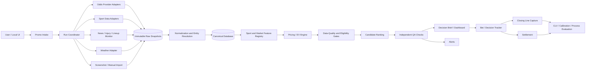

# Advantage Play Intern — Project Context and Product Specification

**Document status:** Initial product specification  
**Version:** 0.1  
**Prepared:** 2026-07-10  
**Default timezone:** America/Chicago

---

## 1. Executive summary

The Advantage Play Intern is a local, human-supervised research and monitoring system for sports promotions and market conditions.

Its core purpose is to solve an **attention problem**:

- markets move throughout the day;
- player availability and lineups change;
- weather and game context change;
- multiple sportsbooks and markets are difficult to monitor simultaneously;
- bookkeeping, grading, and closing-line capture are repetitive;
- a human cannot continuously watch every relevant feed.

The system therefore behaves like a disciplined research intern. It performs narrow jobs repeatedly and consistently, then alerts the user when a defined condition changes or when a candidate merits review.

It does **not** rely on an LLM to spontaneously predict winners. Numerical pricing should come from transparent market methods, validated statistical models, or both. The LLM's main roles are parsing, synthesis, explanation, entity-resolution assistance, and exception handling.

The first recommended product is an **MLB player-hits promotion scanner**. Multi-sport expansion follows only after the initial workflow is reliable, auditable, and measurable.

---

## 2. Product thesis

### 2.1 The useful role of AI

AI is most useful here as:

- an information collector;
- a change detector;
- a data cleaner;
- a source summarizer;
- an entity-matching assistant;
- a report writer;
- a coding and testing assistant;
- an alerting layer over deterministic calculations.

AI is least reliable here when asked:

- “What should I bet?” without current data;
- to invent a probability from a narrative;
- to infer an exact live line from search snippets;
- to conceal uncertainty;
- to replace validation, backtesting, or market comparison.

### 2.2 Governing principle

> Give the system one painfully specific condition, define the required evidence and calculation, and let it watch that condition relentlessly.

### 2.3 Human-in-the-loop boundary

The system may surface **ACTIONABLE FOR REVIEW** candidates. It must not execute or confirm wagers. The user retains responsibility for:

- confirming the sportsbook screen;
- deciding whether to act;
- selecting stake within personal limits;
- complying with local rules and account terms;
- resolving any final discrepancy between the system and the book.

---

## 3. Goals and non-goals

## 3.1 Goals

1. Reduce the amount of time spent monitoring odds, news, lineups, weather, and game states.
2. Parse exact promotion terms and calculate the promotion's true effect on price and break-even probability.
3. Retrieve the exact target-book market when supported by a configured provider.
4. Support screenshots and structured manual entry when API coverage is missing.
5. Normalize players, teams, games, sportsbooks, and markets across sources.
6. Calculate deterministic pricing metrics and rank all eligible token uses.
7. Explain the ranking with current, sourced, timestamped evidence.
8. Alert only on material changes and suppress duplicate noise.
9. Record decisions, closing lines, results, CLV, and process metrics.
10. Support backtesting without look-ahead bias.
11. Expand through modular sport and market adapters.

## 3.2 Non-goals

1. Autonomous bet placement.
2. Sportsbook login automation or credential storage.
3. Circumvention of geolocation, anti-bot, paywall, or access controls.
4. Guaranteed-profit claims.
5. A universal black-box model for every sport and market.
6. Treating social-media claims as authoritative without confirmation.
7. Optimizing only for short-term win rate.
8. Starting with high-frequency live betting before data quality and latency are measured.
9. Building a complex multi-agent framework before reliable functions and schemas exist.

---

## 4. Primary use cases

## 4.1 Promotion evaluation

Example:

> “I have a 30% profit boost for MLB player hits at Sportsbook X today. Maximum stake is $25, minimum odds are -200, and the token expires at 8:00 PM CT. Find and rank the best eligible uses.”

The system should:

- parse the exact terms;
- find eligible player-hit markets at the named book;
- calculate the boosted price correctly;
- estimate fair probability from configured methods;
- compute EV and expected dollars;
- incorporate current lineup, pitcher, park, weather, and player context;
- rank all candidates;
- identify candidates that are not yet actionable because of unconfirmed lineups or stale data;
- preserve an audit snapshot.

## 4.2 Injury and lineup monitoring

The system watches official or licensed sources for:

- status changes;
- confirmed starting lineups;
- batting-order changes;
- starter changes;
- minutes/role changes in basketball;
- goalie confirmations and line combinations in hockey;
- official inactives in football.

It alerts only when the change affects a configured market or candidate.

## 4.3 Weather monitoring

For outdoor sports, the system maps each venue to an appropriate weather location or station and tracks relevant conditions near event time.

It reports raw observations and model inputs. It does not assume every weather narrative creates an edge.

## 4.4 Live trigger monitoring

Example inspired by the transcript:

- monitor first-half college-basketball games;
- detect when both teams enter the bonus under a defined set of timing and score conditions;
- retrieve or accept the live total;
- alert the user with the current state and historical/backtested context.

The trigger must be formally specified and backtested. “Both teams in the bonus” is a hypothesis, not proof of a profitable rule.

## 4.5 Bet tracking and CLV

The system records:

- selected market and price;
- stake;
- timestamp;
- relevant promo;
- pre-decision data snapshot;
- closing comparison price;
- settlement result;
- CLV method;
- model probability and version;
- reason codes.

This creates the feedback loop needed to evaluate whether the process has long-term value.

---

## 5. Product modes

## 5.1 Research mode

Run on demand. Build a complete decision brief from current sources.

## 5.2 Scheduled monitoring mode

Run at configurable intervals and notify only when a meaningful change occurs.

## 5.3 Event-driven mode

Consume a provider webhook, WebSocket, change log, or other push feed. Re-evaluate only affected events and markets.

## 5.4 Screenshot-assisted mode

Accept images of:

- promotion terms;
- market screens;
- bet slips;
- result screens.

Extract structured data, preserve the image, and require verification for material low-confidence fields.

## 5.5 Replay/backtest mode

Reproduce a historical decision using only data available at that historical timestamp.

---

## 6. Recommended architecture



### 6.1 Design rule: functions first, agents second

A “host of agents” can be useful, but the first implementation should be a set of reliable functions and scheduled jobs. Separate LLM agents should be introduced only when they provide a concrete reliability benefit.

Possible logical roles:

- **Coordinator:** manages one run and its state.
- **Promo parser:** converts text or screenshot terms to a schema.
- **Odds collector:** retrieves exact quotes and comparison markets.
- **Sport-context collector:** gathers schedule, lineup, injuries, and relevant stats.
- **Weather collector:** gathers venue-specific observations and forecasts.
- **Normalizer:** resolves identifiers and market synonyms.
- **Pricing engine:** deterministic math only.
- **Analyst:** summarizes drivers and risks.
- **QA reviewer:** independently checks eligibility, arithmetic, freshness, and contradictions.
- **Reporter:** formats the final brief and alerts.

These may initially be ordinary modules rather than independently prompted agents.

---

## 7. Data acquisition strategy

## 7.1 Live odds

### Preferred approach

Use a licensed or documented odds API. Candidate providers include:

| Provider type | Potential value | Main caveat |
|---|---|---|
| General odds API | Fast MVP integration; multiple books; standard markets and selected props | Exact player-prop and target-book coverage varies |
| Enterprise odds comparison feed | Broad book and prop coverage; historical and change feeds | Cost and contract complexity |
| Full sports-data provider with odds | Can unify odds, IDs, lineups, injuries, and settlement | Cost; provider-specific schemas; licensing |
| Sportsbook-approved export/integration | Exact source price | Rare and book-specific |
| Screenshot/manual import | Covers any visible line | Slower; extraction and freshness risk |

Examples to evaluate include The Odds API, Sportradar Odds Comparison, SportsDataIO, OddsJam, OpticOdds, and other licensed feeds. Do not choose solely from marketing claims. Test the exact sportsbook, jurisdiction, sport, market, alternate-line coverage, latency, historical access, and pricing.

### Why ordinary web search is insufficient

Search pages and public articles are not reliable sources for fast-changing, book-specific player-prop prices. A current quote needs:

- exact sportsbook;
- exact jurisdiction/region if applicable;
- exact player and event;
- exact market and side;
- line and price;
- market status;
- retrieval timestamp.

### Scraping boundary

Public-page scraping may be considered only when permitted. The project must not:

- automate authenticated sportsbook account pages;
- bypass anti-bot controls;
- spoof location;
- evade rate limits or source restrictions;
- treat fragile DOM selectors as a production-grade source without monitoring.

## 7.2 League, schedule, lineup, and statistics data

Potential source classes:

1. Official league/team pages and feeds.
2. Licensed sports-data providers.
3. Official statistics platforms, such as MLB's Baseball Savant for Statcast information.
4. Established specialist sources as secondary confirmation.

For MLB, evaluate:

- official MLB schedule, probable-pitcher, lineup, injury, and game sources;
- Baseball Savant/Statcast for batted-ball and pitch metrics;
- a licensed provider when formal SLAs, stable schemas, real-time change feeds, or simpler ID mapping are required.

## 7.3 Weather

The U.S. National Weather Service API is a strong starting source for U.S. venues. It provides forecasts, observations, and alerts through `api.weather.gov` and requires an identifying User-Agent.

The system should maintain a venue table with:

- latitude/longitude;
- roof type;
- altitude;
- park orientation where relevant;
- nearby observation stations;
- preferred forecast grid point;
- timezone.

For retractable-roof venues, roof status should be a separate input rather than inferred from weather alone.

## 7.4 News and social media

Use official injury reports, team announcements, league reports, and licensed feeds where possible. Social media may provide the earliest signal but should carry a lower confidence state until confirmed.

Store:

- author/source;
- publication timestamp;
- original text or compliant summary;
- affected entities;
- confidence;
- confirmation status;
- superseding update.

---

## 8. Canonical data model

The exact database design can evolve, but the following objects should exist from the start.

## 8.1 Promotion

```yaml
promotion:
  promo_id: string
  sportsbook_id: string
  jurisdiction: string | null
  title: string
  sport_keys: [string]
  market_keys: [string]
  boost_type: profit_boost | odds_boost | payout_boost | bonus_bet | insured_bet | other
  boost_percent: number | null
  max_stake: number | null
  payout_cap: number | null
  min_american_odds: integer | null
  max_american_odds: integer | null
  eligible_event_ids: [string] | null
  eligible_start_time_min: datetime | null
  eligible_start_time_max: datetime | null
  expires_at: datetime
  token_count: integer
  reusable: boolean
  parlay_rules: object | null
  void_push_rules: string | null
  raw_terms_source: string
  parsed_confidence: number
  verification_status: confirmed | needs_review
```

## 8.2 Event

```yaml
event:
  event_id: string
  sport: string
  league: string
  season: string
  start_time_utc: datetime
  home_team_id: string
  away_team_id: string
  venue_id: string
  status: scheduled | delayed | postponed | in_progress | final | canceled
  provider_ids: object
```

## 8.3 Market quote

```yaml
market_quote:
  quote_id: string
  event_id: string
  sportsbook_id: string
  jurisdiction: string | null
  market_key: string
  participant_id: string | null
  side: string
  line: number | null
  american_odds: integer
  decimal_odds: number
  status: open | suspended | closed | unknown
  retrieved_at_utc: datetime
  provider_last_update_utc: datetime | null
  source_id: string
  raw_snapshot_id: string
```

## 8.4 Context fact

```yaml
context_fact:
  fact_id: string
  event_id: string | null
  entity_id: string | null
  fact_type: string
  value: object
  status: confirmed | probable | unconfirmed | conflicting | stale
  effective_at_utc: datetime | null
  retrieved_at_utc: datetime
  source_id: string
  raw_snapshot_id: string
```

## 8.5 Candidate evaluation

```yaml
candidate_evaluation:
  evaluation_id: string
  run_id: string
  promotion_id: string
  quote_id: string
  probability_method: market_consensus | statistical_model | blended | manual
  estimated_probability: number
  probability_low: number | null
  probability_high: number | null
  base_decimal_odds: number
  boosted_decimal_odds: number
  break_even_probability: number
  ev_per_unit: number
  expected_dollars: number
  permitted_stake: number
  data_quality_score: number
  state: actionable_for_review | watch | pass | blocked | ineligible
  reason_codes: [string]
  calculation_version: string
  created_at_utc: datetime
```

## 8.6 Decision/bet record

Keep a distinction between a candidate, a user decision, and a wager record. Not every candidate becomes a decision; not every decision is acted on.

```yaml
decision_record:
  decision_id: string
  evaluation_id: string
  user_action: selected | passed | watched | unknown
  selected_stake: number | null
  actual_price: integer | null
  actual_line: number | null
  acted_at_utc: datetime | null
  notes: string | null
```

---

## 9. Entity resolution and data cleaning

A large fraction of engineering work will involve identifying the same entity across providers.

Maintain canonical mapping tables for:

- leagues;
- teams;
- players;
- venues;
- sportsbooks;
- events;
- market types;
- sides and outcomes.

### 9.1 Matching rules

Use stable provider IDs whenever possible. Name matching is a fallback.

Name normalization should account for:

- punctuation and accents;
- initials and suffixes;
- abbreviated and full team names;
- traded players;
- duplicate names;
- event-date context;
- market aliases such as `hits`, `batter_hits`, `total_hits`, or `player_hits`.

### 9.2 Confidence states

- exact provider-ID mapping;
- verified manual mapping;
- high-confidence fuzzy match;
- ambiguous match requiring review;
- unresolved.

Never merge two entities solely because an LLM says the names “look similar.”

---

## 10. Promotion pricing framework

## 10.1 Odds conversion

For positive American odds `A`:

`D = 1 + A / 100`

For negative American odds `A`:

`D = 1 + 100 / |A|`

## 10.2 Profit boost

For an `r%` profit boost:

`m = 1 + r/100`

`D_boosted = 1 + m(D_base - 1)`

This assumes only profit is multiplied. The engine must support separate calculation strategies for other token types.

## 10.3 Break-even probability

`p_break_even = 1 / D_boosted`

## 10.4 No-vig market probability

For a two-way market with decimal prices `D_over` and `D_under`:

`q_over = 1 / D_over`

`q_under = 1 / D_under`

`p_over = q_over / (q_over + q_under)`

Store the de-vig method. Alternative methods may be added and compared.

## 10.5 Expected value

`EV_unit = p_estimated * D_boosted - 1`

`Expected dollars = stake * EV_unit`

## 10.6 Ranking a one-use token

The best token use is not necessarily the largest EV percentage. Rank using at least:

- expected dollars at permitted stake;
- probability uncertainty;
- data quality;
- liquidity/availability risk;
- promo eligibility certainty;
- likelihood the price remains available;
- opportunity cost of waiting for later games;
- correlation/exposure rules;
- user risk limits.

## 10.7 Sensitivity

For every top candidate, show:

- break-even probability;
- estimated probability;
- conservative probability;
- EV at each point;
- price or probability threshold at which the candidate becomes a pass.

---

## 11. Probability methods

A candidate can use one of four methods.

## 11.1 Market consensus

Use comparable prices across books, normalize the market, remove vig, and aggregate robustly.

Advantages:

- fast;
- incorporates broad information;
- often more reliable than an undeveloped model.

Risks:

- books may copy one another;
- stale or low-limit books may distort consensus;
- exact lines may differ;
- the target book may already lead the move;
- player-prop hold can be large.

## 11.2 Statistical model

Use a versioned, validated model built for the exact sport and market.

Requirements:

- documented training data;
- leak-free features;
- out-of-sample evaluation;
- calibration metrics;
- uncertainty estimates;
- retraining schedule;
- drift monitoring.

## 11.3 Blended method

Combine market and model probabilities under a documented weighting rule. Do not choose weights ad hoc per candidate.

## 11.4 Manual method

Allow an expert-supplied probability, but label it clearly and retain the source and rationale.

---

## 12. MLB player-hits MVP

## 12.1 Target market

Start with one or more clearly normalized markets such as:

- over/under 0.5 hits;
- over/under 1.5 hits;
- player to record a hit, if the provider defines it consistently.

Do not treat `total bases`, `hits + runs + RBIs`, and `hits` as interchangeable.

## 12.2 Required context

### Event and player status

- game scheduled and not postponed;
- player active;
- starting lineup status;
- batting-order position;
- home/away;
- doubleheader game number;
- starting pitcher status;
- handedness matchup;
- late scratch or substitution risk.

### Opportunity indicators

- expected plate appearances;
- batting-order slot;
- team implied run environment;
- likelihood of the home team batting in the ninth;
- pinch-hit/substitution risk;
- expected game competitiveness where modeled.

### Hitter indicators

Candidate features include:

- projected batting average or hit probability;
- strikeout rate;
- contact rate and zone-contact rate;
- expected batting average (`xBA`), where available and appropriate;
- expected weighted on-base average (`xwOBA`) as broader quality context;
- hard-hit rate;
- line-drive or batted-ball profile;
- platoon splits with shrinkage;
- recent health or role changes;
- pitch-type performance, only with sufficient sample and stabilization.

### Pitcher and bullpen indicators

- starter handedness;
- strikeout and walk rates;
- expected ERA/FIP-style indicators as context;
- contact and batted-ball profile allowed;
- pitch mix;
- expected pitch count and times-through-order exposure;
- bullpen quality, availability, and handedness mix.

### Park and weather

- park factors;
- temperature;
- wind speed and direction;
- precipitation/delay risk;
- air density or an approved derived measure;
- altitude;
- roof status.

Weather should be incorporated through validated relationships. Do not turn a general weather fact into a strong hits recommendation without evidence.

### Market indicators

- exact target quote;
- comparison-book quotes at the same line;
- consensus fair probability;
- line movement and timestamps;
- market suspension or limit status if available;
- price disagreement across books;
- boost-adjusted break-even probability.

## 12.3 Expected-plate-appearance modeling

Hits depend heavily on plate appearances. A basic MVP estimate can use:

- batting-order slot;
- team run expectation;
- home/away;
- opponent pitching quality;
- probability of extra innings;
- replacement or pinch-hit risk.

A later model can explicitly simulate plate appearances and per-plate-appearance hit probability.

## 12.4 Simple transparent model option

One interpretable approach:

1. Estimate expected plate appearances.
2. Estimate hit probability per plate appearance.
3. Model total hits with a binomial-like or beta-binomial process, adjusted if validation supports it.
4. Calculate `P(H >= 1)`, `P(H >= 2)`, and other required thresholds.
5. Calibrate outputs against held-out data and market prices.

Do not assume plate appearances are independent or identically distributed without testing. The simple model is a starting baseline.

## 12.5 MLB data-quality gates

A top candidate should be downgraded or blocked when:

- the lineup is not confirmed near game time;
- the target quote is stale;
- the provider's player mapping is ambiguous;
- the starting pitcher changed;
- the market is suspended;
- severe weather or postponement risk is unresolved;
- the promotion's minimum odds or eligibility is unclear;
- comparison quotes use a different line;
- the model or consensus is based on materially older context.

---

## 13. Sport-specific KPI registry

This section is a broad roadmap hypothesis inventory, not an adapter catalog and not run authorization. Inclusion does not imply active collection, proven predictive value, an enabled model, provider permission, or a selectable profile. Current authority and lifecycle come only from `SPORT_ADAPTERS/README.md` and the selected adapter location.

The current catalog contains four adapter records and fifteen profile records: one `active`, three `pilot_enabled`, and eleven `disabled_provider_validation`. MLB Section 6 of `PROMO_PLACEMENT_MONITORING_PLAYBOOK.md`, `SPORT_ADAPTERS/WNBA.md`, `SPORT_ADAPTERS/NBA.md`, and `SPORT_ADAPTERS/NFL.md` define which of the ideas below are registered, runnable, disabled, model-only, or excluded. NBA and NFL are credential-free contract and fixture specifications only; all seven of their registered profiles remain disabled and cannot generate candidates. All other sport sections remain conceptual.

## 13.1 MLB

**Availability and role**

- confirmed lineup;
- batting order;
- starting pitcher;
- bullpen availability;
- injuries and roster moves;
- weather/roof status.

**Hitting props**

- expected plate appearances;
- projected BA/OBP/SLG;
- xBA/xwOBA;
- contact, zone contact, chase, strikeout, walk;
- hard-hit, barrel, line-drive and ground-ball rates;
- platoon splits with shrinkage;
- park and air-density context;
- pitcher pitch mix and batter response;
- bullpen handedness and quality.

**Pitching props**

- expected pitch count;
- strikeout rate and swinging-strike indicators;
- opponent strikeout profile;
- catcher and umpire context if validated;
- weather and park;
- bullpen pull risk;
- recent workload and health.

## 13.2 NBA / WNBA

The registered NBA profiles are `nba.full_game.moneyline`, `nba.full_game.spread`, `nba.full_game.total`, and `nba.player.points`. All four are `disabled_provider_validation`; NBA rebounds, assists, and made-threes are unavailable by catalog absence. The registered WNBA lifecycle remains unchanged: three full-game profiles are `pilot_enabled`, while four named player-prop profiles remain `disabled_provider_validation`. Exact NBA and WNBA authority comes from their selected adapters, not from the hypothesis list below.

**Availability and role**

- official injury status;
- confirmed starters;
- projected minutes;
- rotation changes;
- back-to-back/rest/travel;
- coach tendencies.

**Player-prop context**

- usage rate;
- touches and time of possession;
- shot attempts and shot profile;
- rebound chances;
- potential assists;
- on/off splits with teammate absences;
- pace and possession projection;
- opponent positional/scheme context;
- foul risk;
- blowout and overtime probability.

Recent-game averages should not override stable role and opportunity estimates without evidence.

## 13.3 NFL / NCAAF

The registered NFL profiles are `nfl.full_game.moneyline`, `nfl.full_game.spread`, and `nfl.full_game.total`. All three are `disabled_provider_validation`. NFL player props, including passing- and rushing-yard props, are unregistered; the role and game-context ideas below remain future model or profile hypotheses unless `SPORT_ADAPTERS/NFL.md` explicitly uses them as operational gates. NCAAF remains concept-only and unregistered.

**Availability and role**

- official practice reports and game status;
- inactives;
- snap share;
- routes run/route participation;
- target share and air-yard share;
- rushing share and goal-line role;
- offensive-line changes;
- quarterback status.

**Game context**

- pace and pass rate over expectation;
- likely game script;
- opponent coverage/front tendencies;
- weather, wind, and field conditions;
- travel/rest;
- coaching changes;
- market total and spread.

## 13.4 NHL

**Availability and role**

- confirmed starting goalie;
- line combinations;
- power-play unit;
- time-on-ice expectation;
- injuries;
- back-to-back and travel.

**Shots and scoring props**

- individual shot attempts and shots on goal;
- expected goals;
- power-play opportunity;
- opponent shot suppression;
- expected game state;
- goalie quality;
- line-mate changes.

## 13.5 College basketball live triggers

**Game state**

- time remaining;
- score and margin;
- possession estimate;
- team fouls by half;
- bonus/double-bonus state;
- free-throw rate;
- pace relative to expectation;
- foul-prone players and substitutions;
- live total and price;
- timeout and end-of-half context.

A rule such as “both teams in the bonus in the first half” should include timing, score, pace, and price constraints and must be evaluated out of sample.

## 13.6 Soccer

**Status:** Concept-only roadmap hypotheses. No soccer or World Cup adapter/profile is registered, selectable, or runnable. A future phase must first discover exact promotion terms, market identities, settlement rules, source permissions, consensus coverage, materiality, and refresh behavior using `SPORT_ADAPTERS/ADAPTER_TEMPLATE.md`.

- confirmed lineups and formations;
- player availability;
- expected minutes;
- set-piece roles;
- xG and shot quality;
- pace/game state;
- travel/rest;
- weather/pitch;
- goalkeeper changes;
- market liquidity and lineup timing.

## 13.7 Adding a new sport or market

Every adapter must conform to `adapter_contract_v1` and define:

1. canonical market keys;
2. required event and participant data;
3. source hierarchy;
4. feature registry;
5. freshness thresholds;
6. data-quality gates;
7. pricing method;
8. settlement rules;
9. test fixtures;
10. report language.

---

## 14. Scheduling and change detection

## 14.1 Why one global schedule is insufficient

Different data changes at different rates. Schedules should be tied to event start time and source behavior.

## 14.2 Example MLB cadence

| Window | Suggested action |
|---|---|
| Early morning | Build slate, probable pitchers, initial markets, weather outlook |
| More than 6 hours before game | Refresh hourly or on provider change feed |
| 6 to 2 hours before game | Refresh every 15 minutes |
| 2 hours to 15 minutes before game | Refresh every 5 minutes, emphasizing lineup and quote changes |
| Inside 15 minutes | Refresh only as justified by provider limits and user workflow |
| At meaningful change | Re-evaluate affected candidates immediately |
| Near close | Capture target and comparison closing prices |
| After final | Settle and update tracking metrics |

This is a starting configuration, not a universal rule.

## 14.3 Material-change examples

- target price moves across a break-even threshold;
- lineup becomes confirmed;
- player changes batting-order slot;
- starting pitcher changes;
- player is scratched;
- weather reaches a configured risk threshold;
- promo expires soon;
- a better candidate overtakes the current leader;
- data becomes stale or a provider fails.

## 14.4 Alert deduplication

Generate a new alert only when:

- state changes;
- ranking changes materially;
- EV changes beyond a configured threshold;
- a blocker resolves or appears;
- a critical context fact changes;
- a freshness or provider-health threshold is breached.

Every alert should include “what changed since the last alert.”

---

## 15. Decision brief design

A useful brief should be compact enough to act on but complete enough to audit.

## 15.1 Header

- run time;
- promotion and sportsbook;
- status;
- time remaining before expiration;
- data freshness and provider health.

## 15.2 Ranked table

Suggested columns:

| Rank | Candidate | Book line | Boosted price | Break-even | Estimated p | EV | Expected $ | Status | Main blocker/risk |
|---|---|---:|---:|---:|---:|---:|---:|---|---|

## 15.3 Candidate detail

For the top few candidates:

- exact market and quote timestamp;
- probability source;
- price comparison;
- lineup and game context;
- strongest supporting factors;
- strongest counterarguments;
- conservative sensitivity;
- invalidation conditions;
- source list.

## 15.4 Passes

Show why plausible alternatives were rejected:

- below threshold;
- lower expected dollars;
- stale quote;
- lineup unconfirmed;
- ineligible odds;
- conflicting data;
- dominated by another candidate.

This reduces selection bias and makes the process testable.

---

## 16. Bet tracking, closing-line value, and evaluation

## 16.1 Closing line source

Configure one or more reference methods:

- target-book closing line;
- consensus close;
- selected sharp/low-hold books;
- exchange or market-maker source;
- no-vig consensus.

Do not change the source after seeing the outcome.

## 16.2 CLV methods

Store both the raw price difference and a probability-space measure where appropriate. Document the exact formula.

Possible outputs:

- entry implied probability vs closing no-vig probability;
- entry decimal price vs closing equivalent;
- log-odds difference;
- percentage CLV.

## 16.3 Process metrics

Track:

- number of promotions analyzed;
- percentage with usable data;
- candidates by state;
- alert precision and duplicate rate;
- time from source change to alert;
- quote-age distribution;
- extraction correction rate;
- average and median CLV;
- model Brier score/log loss/calibration;
- realized ROI with confidence intervals;
- performance by sport, market, book, and reason code;
- time saved.

A positive short-term ROI without positive CLV or calibration may be noise.

---

## 17. Quality assurance

## 17.1 Independent checks

Before a candidate becomes ACTIONABLE FOR REVIEW, verify:

1. correct sportsbook;
2. correct event and player;
3. correct market and side;
4. exact line and price;
5. quote freshness;
6. promo eligibility;
7. correct boost formula;
8. probability method and timestamp;
9. lineup/injury status;
10. arithmetic;
11. expected-dollar ranking;
12. no unresolved contradiction.

## 17.2 Data-quality score

A score can summarize quality, but raw flags must remain visible. Example components:

- target quote freshness;
- comparison-market freshness;
- lineup confirmation;
- player/event mapping confidence;
- source authority;
- probability-method validation;
- weather/status completeness;
- provider health.

Do not allow a high aggregate score to hide a fatal issue such as the wrong player or book.

## 17.3 Failure behavior

On provider failure:

- retain last successful snapshot;
- label it stale;
- do not silently reuse it as current;
- attempt configured fallback;
- alert when the system cannot produce recommendation-grade output.

---

## 18. Security, compliance, and operational safeguards

- Store API keys outside source control.
- Encrypt sensitive local configuration where practical.
- Use least-privilege provider credentials.
- Maintain a global scheduler kill switch.
- Maintain per-provider rate limiting and retries with backoff.
- Respect licensing, terms, robots/access rules, and jurisdictional constraints.
- Do not automate sportsbook authentication or wagering.
- Keep an audit log of manual corrections and configuration changes.
- Allow the user to set exposure and notification limits.
- Back up the canonical database and raw snapshots.

---

## 19. Phased roadmap

## Phase 0 — Research and provider validation

- choose target sportsbook(s) and jurisdiction;
- list exact MLB hit market labels needed;
- trial at least one odds API;
- verify book and prop coverage at multiple times of day;
- choose lineup/stat and weather sources;
- define promotion schema and output requirements.

**Exit criterion:** a written coverage matrix with real sample payloads.

## Phase 1 — Manual-input calculator

- structured promotion form;
- manual market quote entry;
- deterministic boost, break-even, no-vig, EV, expected-dollar math;
- candidate ranking;
- report generation;
- unit tests.

**Exit criterion:** correct results for golden test cases.

## Phase 2 — Automated MLB pregame data

- odds-provider adapter;
- schedule/event mapping;
- probable pitchers;
- confirmed lineups;
- weather;
- immutable snapshots;
- simple dashboard.

**Exit criterion:** same-day slate can be built with clear freshness and mapping status.

## Phase 3 — Monitoring and alerts

- event-relative scheduler;
- change detection;
- alert deduplication;
- provider health monitoring;
- candidate re-ranking.

**Exit criterion:** lineup and price changes generate timely, non-duplicative alerts.

## Phase 4 — Tracking and feedback loop

- decision log;
- closing-line capture;
- settlement;
- CLV metrics;
- process dashboard.

**Exit criterion:** every acted-on decision can be reconstructed and evaluated.

## Phase 5 — Model and backtesting

- historical snapshots or licensed historical data;
- baseline plate-appearance/hit model;
- leak-free replay;
- calibration and out-of-sample evaluation;
- comparison with market-only method.

**Exit criterion:** model adds measurable value or is rejected.

## Phase 6 — Multi-book and multi-sport expansion

Add one adapter at a time. Each must meet the “adding a new sport or market” checklist.

## Phase 7 — Live triggers

Only after latency, reliability, market access, and historical trigger performance are measured.

---

## 20. MVP acceptance criteria

The MLB player-hits promotion scanner is ready for supervised use when it can:

1. parse a 30% profit-boost promotion and display all extracted terms;
2. retrieve or accept exact target-book hit lines;
3. reject mismatched books, players, games, sides, and lines;
4. apply the boost and calculate break-even correctly;
5. estimate fair probability using a documented method;
6. rank every eligible candidate by expected dollars and quality;
7. distinguish actionable, watch, pass, blocked, and ineligible states;
8. display quote, lineup, pitcher, weather, and source timestamps;
9. re-rank after a lineup or price change;
10. preserve a raw and canonical audit snapshot;
11. record the user's decision without placing a wager;
12. capture a closing comparison and settle the result;
13. pass unit, integration, and golden tests;
14. visibly fail closed when material data is stale or missing.

---

## 21. Suggested configuration skeleton

```yaml
app:
  timezone: America/Chicago
  mode: local
  currency: USD

sportsbooks:
  target_books:
    - id: example_book
      display_name: Example Sportsbook
      jurisdiction: USER_CONFIGURES

providers:
  odds:
    primary: USER_CONFIGURES
    fallback: manual_screenshot
  mlb_data:
    primary: USER_CONFIGURES
  weather:
    primary: nws

freshness_seconds:
  target_quote_pregame: 180
  comparison_quote_pregame: 300
  confirmed_lineup: 600
  weather_observation: 900

thresholds:
  minimum_ev_per_unit: USER_CONFIGURES
  minimum_data_quality: USER_CONFIGURES
  material_ev_change: USER_CONFIGURES
  max_probability_uncertainty: USER_CONFIGURES

risk_controls:
  max_stake_per_promo: USER_CONFIGURES
  max_daily_exposure: USER_CONFIGURES
  max_weekly_exposure: USER_CONFIGURES
  fractional_kelly_cap: 0.25
  autonomous_wagering: false

schedules:
  daily_slate_local_time: "05:30"
  far_pregame_minutes: 60
  mid_pregame_minutes: 15
  near_pregame_minutes: 5

alerts:
  channels: [local_dashboard]
  deduplicate: true
  include_change_summary: true

storage:
  database_url: sqlite:///data/ap_intern.db
  raw_snapshot_dir: data/raw
  screenshot_dir: data/screenshots
```

Thresholds should not be chosen merely to produce recommendations. They should be validated against data quality, model uncertainty, transaction friction, and historical performance.

---

## 22. Current implementation notes and source references

These references were current when this document was prepared. Provider coverage and product behavior can change, so re-verify before implementation.

- OpenAI, **Scheduled Tasks in ChatGPT**: https://help.openai.com/en/articles/10291617-tasks-in-chatgpt
- OpenAI, **Scheduled tasks / local project workflows**: https://learn.chatgpt.com/docs/automations
- OpenAI, **Custom instructions with AGENTS.md**: https://learn.chatgpt.com/docs/agent-configuration/agents-md
- The Odds API, **V4 documentation**: https://the-odds-api.com/liveapi/guides/v4/
- Sportradar, **Odds Comparison Player Props API overview**: https://developer.sportradar.com/odds/reference/oc-player-props-overview
- Sportradar, **MLB lineups and game rosters**: https://developer.sportradar.com/baseball/docs/mlb-ig-tracking-lineups-game-rosters
- SportsDataIO, **Betting Odds API overview**: https://sportsdata.io/live-odds-api
- National Weather Service, **API Web Service**: https://www.weather.gov/documentation/services-web-api
- MLB Baseball Savant, **Statcast Search**: https://baseballsavant.mlb.com/statcast_search

---

## 23. Final product principle

The system should be judged by whether it reliably notices, validates, calculates, explains, and records the right things—not by whether it can produce a confident-sounding pick on demand.
